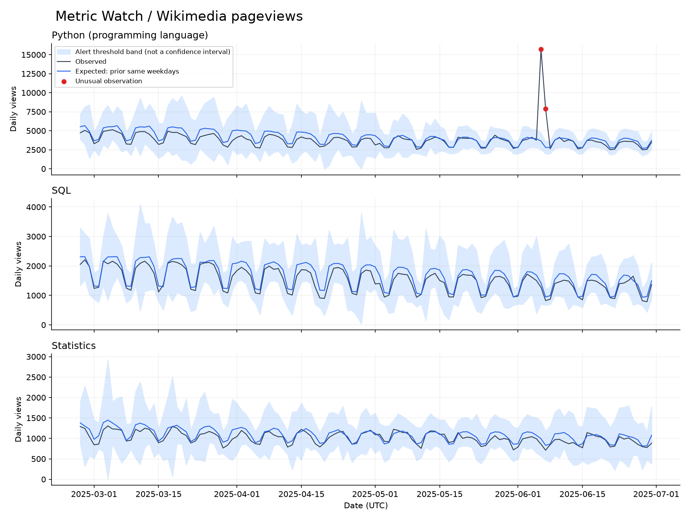

# Metric Watch

Мониторинг дневного трафика: загрузка данных, поиск необычных значений с учётом
дня недели и очередь алертов для ручного разбора.

**Вопрос проекта:** как замечать резкие изменения метрики и не реагировать
на обычное падение трафика по выходным?

Здесь две отдельные проверки. На открытых данных Wikipedia можно посмотреть,
какие даты система выделяет для изучения. На искусственных рядах с известными
вставками можно посчитать precision, recall и число ложных тревог.



## Запуск

Python 3.11 или новее. Основной код использует только стандартную библиотеку.
Команды выполняются из корня репозитория.

```bash
python -m unittest discover -s tests -v
python monitor.py demo
python experiments.py
python monitor.py run data/wikimedia.csv
```

Для проверки сохранённого набора данных интернет не нужен. Результаты:

- `reports/demo/report.md` — сравнение двух методов на синтетике;
- `reports/stress/report.md` — работа тех же порогов при других условиях;
- `reports/wikimedia/report.md` — найденные эпизоды в реальных данных;
- `scores.csv` — прогноз нормы, наблюдение, score и флаг для каждого дня;
- `monitor.sqlite` — наблюдения, результаты и черновики алертов;
- `alert_drafts.json` — эпизоды для ручного разбора, без отправки сообщений.

Обновить данные из API:

```bash
python monitor.py fetch --user-agent "MetricWatch/0.1 (https://github.com/wreaxtrr)"
python monitor.py run data/wikimedia.csv
```

По умолчанию загружаются три страницы английской Wikipedia за январь–июнь 2025:
`Python_(programming_language)`, `SQL`, `Statistics`. Параметры `--start`, `--end`
и `--articles` позволяют выбрать другой период и страницы. Используются
дневные просмотры в UTC, `all-access`, категория агента `user`.

График строится отдельно:

```bash
python -m pip install -r requirements-plot.txt
python plot_report.py reports/wikimedia --threshold 6
```

## Как устроено обнаружение

Для дня `t` берутся восемь предыдущих таких же дней недели. Например, для
понедельника — восемь предыдущих понедельников, без текущего наблюдения.

```text
expected = median(previous_same_weekdays)
MAD      = median(abs(previous_same_weekdays - expected))
scale    = max(1.4826 * MAD, 0.05 * expected, 1)
score    = abs(observed - expected) / scale
alert    = score > threshold
```

Минимальный масштаб нужен, чтобы почти постоянные ряды не создавали огромное
значение score из-за небольшого изменения. Это эвристика, а не доверительный
интервал и не p-value. Порог требует проверки на конкретной метрике.

Для сравнения реализован простой метод: среднее и стандартное отклонение
по всем предыдущим 56 дням без разделения по дням недели.

Соседние дни с алертом одного направления объединяются в эпизод. Повторный
запуск обновляет текущий результат в SQLite и не размножает черновики.
Пропуски, дубли, отрицательные значения и NaN вызывают ошибку валидации;
пропущенный день не подменяется нулём.

## Что получилось

### Контролируемый эксперимент

Три искусственных ряда по 365 дней: недельная сезонность, небольшой тренд,
шум и заранее заданные короткие всплески/падения. Первые 112 дней — начальная
история, следующие 112 — выбор порога, оставшиеся 141 — отложенная проверка.
История обновляется последовательно: при оценке очередного дня доступны
только более ранние наблюдения.

Порог выбирается на validation: максимальный recall при не более одной
ложной тревоги на 100 нормальных наблюдений. При равенстве выбираются
больший precision, затем больший порог. Отложенный test не участвует в выборе.

| Метод | Порог | Precision на test | Recall на test | FP / 100 нормальных дней |
|---|---:|---:|---:|---:|
| Среднее по окну | 2 | 1.00 | 0.70 | 0.00 |
| Медиана по дням недели | 6 | 1.00 | 1.00 | 0.00 |

Это простой сценарий с крупными отклонениями, а не оценка качества на реальном
продукте. Оба метода нашли хотя бы один день каждого из девяти тестовых
инцидентов. Разница в recall показывает, сколько **дней** инцидентов они заметили.

При повышенном шуме и более слабых отклонениях сезонный метод с тем же порогом
пропускает большинство аномальных дней: recall падает до **0.067**.
Среднее по окну даёт recall **0.333**, но **1.527** ложной тревоги на 100
нормальных дней, превышая исходный бюджет. [Полная проверка](reports/stress/report.md).

Следствие: одного удачного сценария недостаточно. Порог 6 нельзя без проверки
перенести на любой новый источник. Нужны размеченные эпизоды и выбор допустимого
соотношения между пропусками и нагрузкой на человека, который разбирает алерты.

### Реальные данные

Сохранены **543 наблюдения**: 181 день × 3 страницы. После 56 дней начальной
истории остаются 375 оцениваемых наблюдений. При пороге 6 выделен один эпизод:
рост просмотров `Python_(programming_language)` 6–7 июня 2025.

Причина роста здесь не установлена. Без разметки неизвестно, сколько
отклонений пропущено и какая доля найденных эпизодов полезна. Просмотры статьи
также не равны числу уникальных пользователей.

## Структура

```text
monitor.py               загрузка, валидация, расчёт, SQLite, отчёт
experiments.py           проверка фиксированных порогов на других сценариях
plot_report.py           необязательное построение графика
sql/triage.sql           запросы для разбора очереди алертов
tests/test_monitor.py    проверки расчётов, утечек времени и повторного запуска
data/                    сохранённый ответ API в CSV и описание источника
reports/                 результаты воспроизводимых запусков
```

## Границы проекта

- Это пакетный анализ дневных рядов. Сервис непрерывного мониторинга и доставка
  уведомлений пока не реализованы.
- Ожидание учитывает день недели, но не праздники, годовую сезонность или
  смену режима. При долгом изменении уровня история постепенно к нему адаптируется.
- Окно содержит только восемь значений того же дня недели: оценка разброса может
  быть нестабильной. Минимальный масштаб 5% влияет на чувствительность.
- Проверены только неотрицательные счётчики. Для конверсии нужен отдельный
  метод, учитывающий и числитель, и знаменатель.
- Суммарная доля алертов в SQL — нагрузка на разбор, а не false-positive rate.
- При другом пороге укажите такое же значение в `plot_report.py`.

Дальнейшая работа: разметить реальные эпизоды, проверить параметры на нескольких
временных интервалах и добавить отдельный сигнал о задержке поступления данных.

## Данные и лицензия

Источник — [Wikimedia Analytics API](https://doc.wikimedia.org/generated-data-platform/aqs/analytics-api/).
Данные API распространяются под [CC0 1.0](https://doc.wikimedia.org/generated-data-platform/aqs/analytics-api/documentation/access-policy.html).
URL запросов и время загрузки сохранены в `data/wikimedia.source.json`.
Синтетические ряды создаются локально с фиксированным seed. Код — MIT.
